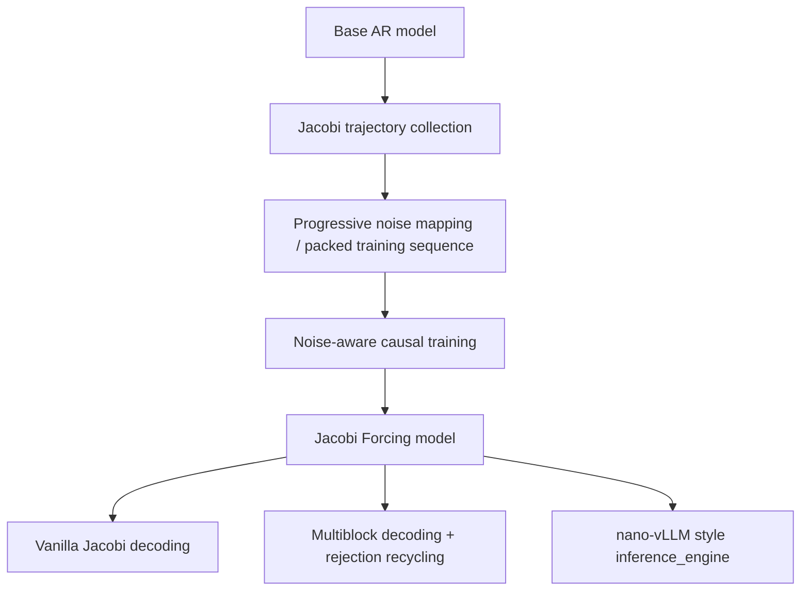
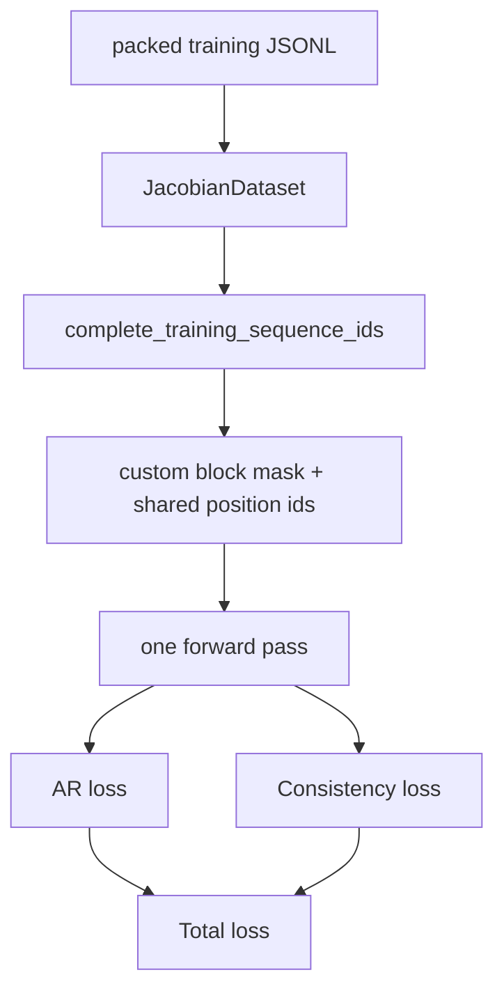
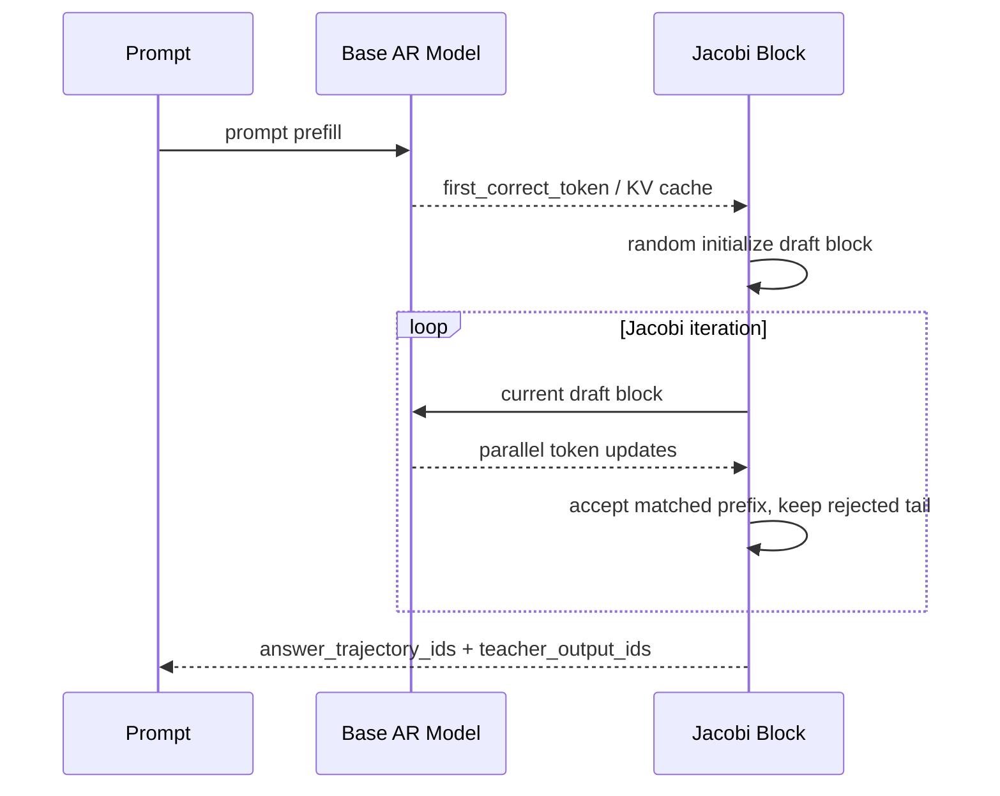
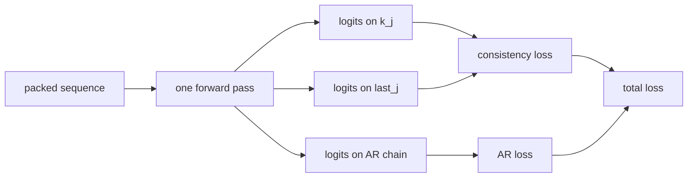
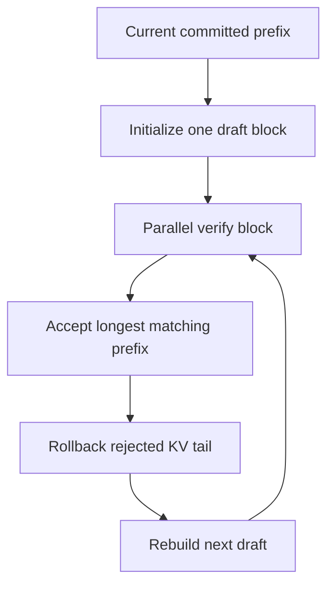
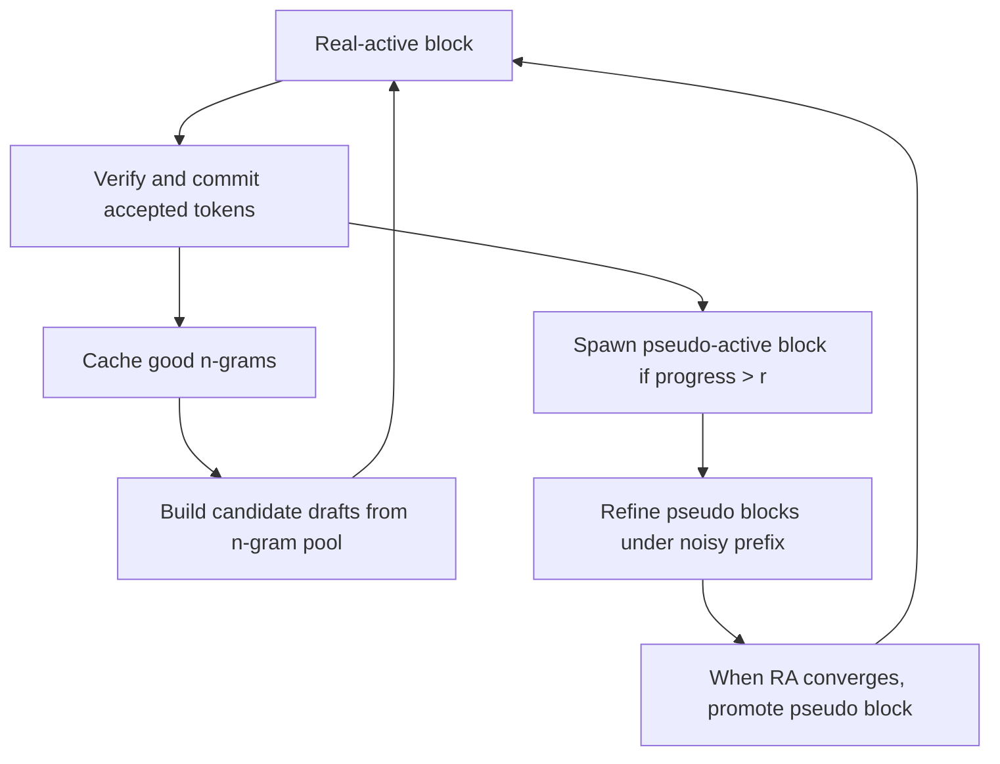

# JacobiForcing Repository Analysis

## 1. 문서 목적과 참고 소스

이 문서는 `JacobiForcing` 저장소를 "코드 기준"으로 정리한 분석 문서다. 특히 아래 두 소스를 함께 참고했다.

- Paper: https://arxiv.org/abs/2512.14681
- Blog: https://haoailab.com/blogs/jacobi-forcing/
- Repo README: `README.md`

정리 범위는 다음과 같다.

1. 저장소 전체 구조와 폴더/파일 역할
2. 데이터 준비와 학습 절차의 실제 흐름
3. 추론 경로와 엔진 구조
4. 논문/블로그 설명과 코드 구현이 어디까지 일치하는지
5. 세부 로직을 도식과 함께 설명

핵심 결론부터 말하면:

- 이 저장소의 핵심 아이디어는 논문/블로그 설명과 전반적으로 잘 일치한다.
- 특히 `progressive noise schedule`, `packed training sequence`, `noise-aware causal attention`, `AR loss + consistency loss`는 코드에 명확하게 구현되어 있다.
- 다만 "멀티블록 + rejection recycling"은 저장소 전체에는 구현되어 있지만, 구현 경로가 둘로 나뉜다.
  - `modeling/` + 실험 스크립트 경로: 구현되어 있음
  - `inference_engine/` 경로: 현재 plain Jacobi 중심이며 multiblock MR은 아직 미구현 상태

---

## 2. High-Level Summary

Jacobi Forcing는 "AR 모델을 diffusion-style parallel decoder처럼 동작하게 만들되, causal backbone과 KV-cache 친화성을 유지"하려는 학습 기법이다.

전체 파이프라인은 아래처럼 이해하면 가장 쉽다.



조금 더 풀어 쓰면:

- 먼저 base AR 모델로 Jacobi trajectory를 생성한다.
- trajectory 안의 intermediate state를 "노이즈가 섞인 상태"로 보고, 마지막 fixed point를 clean target으로 본다.
- 여러 block의 noisy/clean pair를 하나의 긴 sequence로 packing한다.
- causal mask를 유지하되, noisy block이 이전 noisy context를 보도록 하는 custom attention mask를 사용해 한 번의 forward에서 여러 block의 consistency loss와 AR loss를 같이 계산한다.
- 이렇게 학습된 모델은 Jacobi decoding 중 더 긴 correct tail과 더 좋은 draft n-gram을 만들게 되고, 이를 이용해 multiblock decoding과 rejection recycling으로 추가 속도 향상을 얻는다.

---

## 3. 저장소 구조 한눈에 보기

```text
JacobiForcing/
├── README.md
├── requirements.txt
├── applications/
├── assets/
├── generate_trajectory/
│   ├── generation/
│   └── data/
├── inference_engine/
├── modeling/
└── JacobiForcing/
    ├── train/
    ├── scripts/
    └── inference/eval scripts
```

실제로는 "연구용 실험 스크립트 묶음"과 "조금 더 정리된 inference engine"이 함께 들어 있다고 보는 편이 맞다.

---

## 4. 폴더와 파일 설명

## 4.1 루트 파일

### `README.md`

- 논문/블로그/모델 가중치 링크
- 설치 방법
- 데이터 준비, 학습, 추론, 평가의 개략적 사용법
- 그림과 GIF를 통한 개념 설명

### `requirements.txt`

- 실험/학습/추론에 필요한 Python 의존성 목록

### `LICENSE`

- Apache-2.0 라이선스

---

## 4.2 `applications/`

사용자 데모와 스트리밍 UI 계층이다.

### `applications/jacobi_model_chat.py`

- Streamlit 기반 챗봇 데모
- 좌측 패널에서 `n_token_seq_len`, `K`, `r`, `n_gram_pool_size` 같은 Jacobi MR 하이퍼파라미터를 조절할 수 있다.
- 내부적으로 HF `Qwen2ForCausalLM`에 custom multiblock Jacobi 함수를 monkey-patch해서 사용한다.

### `applications/jacobi_streaming_driver.py`

- 채팅용 streaming generation driver
- `prefill_phase -> draft init -> jacobi_forward_greedy_multiblock 반복` 흐름을 캡슐화한다
- 토큰 단위 또는 chunk 단위 스트리밍을 지원한다

정리하면 `applications/`는 "논문 아이디어를 interactive demo로 보여주는 층"이다.

---

## 4.3 `assets/`

문서/README/블로그용 이미지와 GIF가 들어 있다.

주요 파일:

- `jacobi_forcing_example_demo.gif`: Jacobi Forcing 데모
- `ar_example_demo.gif`: AR baseline 데모
- `decoding_comparison.gif`: Jacobi vs diffusion 비교
- `trajectory.jpeg`: high-quality draft 설명 그림
- `noise_schedule_and_sequence_packing.gif`: progressive noise packing 설명
- `noisy_context_attention_mask.jpeg`: noisy-context attention mask 그림
- `multiblock_rejection_recycling.gif`: multiblock + rejection recycling 설명
- `baseline_comparison.py`, `baseline_comparison.sh`: 비교 플롯/실험 보조

이 폴더는 코드 로직을 설명할 때 직접 참조할 수 있는 "논문 그림의 로컬 버전"에 가깝다.

---

## 4.4 `generate_trajectory/`

이 폴더는 학습 데이터 준비의 출발점이다.

크게 두 단계로 나뉜다.

1. `generation/`: base model로 trajectory 생성
2. `data/`: trajectory를 학습용 packed sequence로 변환

### 4.4.1 `generate_trajectory/generation/`

#### `generate_trajectory_opencodeinstruct_greedy.py`

- OpenCodeInstruct bucket 파일을 읽는다
- Qwen 모델에 `get_jacobi_forward_trajectory_greedy`를 patch한다
- prompt별로 Jacobi trajectory를 생성하고 JSON으로 저장한다
- 출력 예시는 대략 다음 필드를 갖는다
  - `diffusion_itr_id`
  - `data_id`
  - `prompt_ids`
  - `answer_trajectory_ids`
  - `teacher_output_ids`

즉, "raw trajectory 생성기"다.

#### `generate_trajectory_opencodeinstruct_nongreedy.py`

- non-greedy trajectory 생성 버전
- sampling 기반 trajectory 수집에 사용

#### `qwen2_modeling_jacobi_forcing_greedy.py`

- HF `Qwen2ForCausalLM`에 붙여 쓰는 greedy Jacobi trajectory 생성 로직
- prefill phase와 generation phase를 나눠 처리한다
- mismatch 이후의 KV를 잘라내는 `DynamicCache.delete_false_key_value`를 직접 추가한다

#### `qwen2_modeling_jacobi_forcing_nongreedy_blk32.py`

- non-greedy trajectory 수집용 Qwen custom decoding 로직

#### `.sh` 파일들

- 특정 실험 세팅으로 trajectory generation을 돌리기 위한 wrapper 스크립트

### 4.4.2 `generate_trajectory/data/`

이 폴더는 연구 실험의 흔적이 많이 남아 있어서 파일이 많다. 이름 앞 숫자가 대체로 stage를 의미한다.

#### `-1_opencodeinstruct_data_filtering.py`

- raw OpenCodeInstruct를 점수 기반으로 filtering/ranking

#### `0_bucketing_opencodeinstruct.py`

- code 데이터셋을 길이 기준 bucket으로 분리
- 이후 trajectory generation 배치를 효율적으로 돌리기 위한 준비 단계

#### `0_bucketing_openthought2.py`

- math 데이터셋(OpenThoughts2) 버킷팅 버전

#### `1_*prepare_trajectory*.py`

- trajectory 준비의 초기/대안 버전들
- masking 기반, progressive masking 기반, inference 기반 등 여러 실험 경로가 있다

중요 포인트:

- prefix가 `1_progressive_*`인 파일들은 noisy trajectory를 점진적으로 만들기 위한 전처리 실험이다
- 현재 README와 가장 잘 맞는 실전 경로는 raw Jacobi trajectory를 먼저 모으고, 이후 `2_prepare_efficient_*progressive_noise_window.py`로 packing하는 경로다

#### `2_prepare_efficient_cllm_training_data_progressive_noise_window.py`

- 이 저장소에서 가장 중요한 data prepare 스크립트 중 하나
- trajectory 안의 intermediate state들 중에서 "목표 noisy ratio에 가장 가까운 상태"를 골라 `k_j`로 사용한다
- 마지막 fixed point를 `last_j`로 사용한다
- 여러 iteration의 `(k_j, last_j)` pair를 diffusion iteration 순서대로 정렬해서 한 긴 sequence로 이어 붙인다
- 최종 출력은 학습용 JSONL이며 다음 필드를 가진다
  - `prompt_ids`
  - `complete_training_sequence_ids`
  - `prompt_ids_len`
  - `traj_position_indices`

#### `2_prepare_efficient_cllm_training_data.py`
#### `2_prepare_efficient_cllm_training_data_new.py`
#### `2_prepare_efficient_cllm_training_data_new_progressive_noise.py`
#### `2_prepare_efficient_cllm_training_data_new_progressive_noise_cyclic.py`

- 같은 아이디어의 실험/변형 버전들
- progressive noise 선택 방식과 packing 전략이 조금씩 다르다

#### `2_prepare_baseline_training_data_sft.py`
#### `2_prepare_baseline_training_data_sft_reverse_engineering.py`

- baseline SFT 학습용 데이터 준비
- Jacobi Forcing이 아닌 AR baseline 재현용

#### `3_*`

- downsample, 길이 필터링, 후처리용 유틸리티

#### `tool_*`

- merge, profile, debug, checkpoint merge 같은 보조 유틸리티

요약하면 `generate_trajectory/`는 "원본 데이터셋 -> Jacobi trajectory -> packed training sequence"를 만드는 전체 data factory다.

---

## 4.5 `JacobiForcing/`

이 폴더 이름이 저장소 이름과 같아서 헷갈리지만, 실제로는 "연구용 학습/평가 엔트리 스크립트" 모음에 가깝다.

### 추론/평가 스크립트

#### `jacobi_forcing_inference_humaneval.py`

- vanilla Jacobi decoding으로 HumanEval 생성
- custom model patch를 사용한다
- 하드코딩된 경로가 많아 연구용 스크립트 성격이 강하다
- 현재 import하는 `cllm2_qwen2_modeling_kv_terminate_on_eos_improved_continuous_drafting` 파일이 저장소에 없어, 최신 트리 기준으로는 바로 실행되지 않을 가능성이 높다

#### `jacobi_forcing_inference_MR_humaneval.py`

- multiblock + rejection recycling 버전 HumanEval 생성
- `jacobi_forward_greedy_multiblock`를 사용한다

#### `jacobi_forcing_inference_MATH500.py`
#### `jacobi_forcing_inference_MR_humaneval_config_grid_search.py`

- 벤치마크/하이퍼파라미터 탐색용 스크립트

#### `ar_inference_baseline.py`

- AR baseline 생성 및 속도 측정용

### `train/`

이 폴더가 실제 학습 구현의 중심이다.

#### 현재 메인 경로

- `soft_flexattn_train_cllm_multiblock.py`
- `soft_flexattn_cllm_trainer_multiblock.py`

이 둘이 현재 가장 핵심이다.

역할 분담:

- `soft_flexattn_train_cllm_multiblock.py`
  - argument parsing
  - model/tokenizer 로딩
  - dataset 로딩
  - optimizer/scheduler/accelerate/deepspeed 설정
  - trainer 호출

- `soft_flexattn_cllm_trainer_multiblock.py`
  - packed sequence 해석
  - custom block mask 생성
  - AR loss 계산
  - consistency loss 계산
  - backward 수행

#### window/locality 변형

- `soft_flexattn_train_cllm_multiblock_window.py`
- `soft_flexattn_cllm_trainer_multiblock_window.py`

window 단위로 noisy context를 제한하는 변형이다.

#### 단일/이전 버전 계열

- `soft_flexattn_train_cllm.py`
- `soft_flexattn_cllm_trainer.py`
- `train_cllm.py`
- `cllm_trainer.py`

이전 세대의 단일 block/CLLM 스타일 학습 경로다.

#### baseline

- `baseline_sft_train.py`

#### `deprecated/`

- 이전 실험 코드와 백업들이 들어 있다
- 분석 관점에서는 참고용이며, 현재 주 경로로 보기는 어렵다

### `scripts/`

#### `scripts/train/*.sh`

- 실제 학습 실행 예시
- 예를 들어 `train_jacobi_forcing_coder_n32.sh`, `train_jacobi_forcing_coder_n64.sh`는
  - base checkpoint
  - packed trajectory JSONL
  - output path
  - `torchrun` 설정
  - block size
  를 묶어둔 실행 스크립트다

#### `scripts/inference/*.sh`

- inference hyperparameter scanning용

#### `scripts/tool/*.py`

- grid search 결과 시각화, 로그 파싱 등 보조 도구

---

## 4.6 `modeling/`

HF 모델 monkey-patching 중심의 custom decoding 구현이 들어 있다.

### `cllm2_qwen2_modeling_kv_terminate_on_eos_improved.py`

- vanilla Jacobi decoding 관련 custom Qwen 구현

### `cllm2_qwen2_modeling_kv_terminate_on_eos_improved_multiblock_lookahead_unified.py`

- multiblock decoding + rejection recycling 구현의 핵심
- 논문에서 말하는 real-active / pseudo-active / n-gram pool / candidate verification이 여기에 직접 들어 있다

즉, `modeling/`은 논문 속 고성능 decoding 실험을 HF 모델 위에 직접 실험하기 위한 핵심 구현체다.

---

## 4.7 `inference_engine/`

README에서 말하는 "lightweight inference engine"이다. 구조적으로는 nano-vLLM 스타일이다.

### 상위 파일

#### `llm.py`

- 사용자-facing API
- `generate()`에서 Jacobi 옵션을 쉽게 넘길 수 있게 해준다

#### `config.py`

- 엔진 설정과 모델/캐시 관련 하이퍼파라미터

#### `sampling_params.py`

- decode strategy와 Jacobi 하이퍼파라미터 정의
- 현재 주석상 지원 전략은 `autoregressive`, `jacobi`
- `jacobi_multiblock_rejection_recycling`는 아직 미지원이라고 명시한다

### `engine/`

#### `engine/llm_engine.py`

- request 추가
- scheduler와 model runner 연결
- prefill/decode loop 실행

#### `engine/model_runner.py`

- 실제 모델 실행 담당
- tensor parallel 프로세스 관리
- KV cache 할당
- CUDA graph capture
- Jacobi decoder 라우팅

#### `engine/jacobi_decoding.py`

- minimal greedy Jacobi decoder
- K=1, no multiblock, no rejection recycling

#### `engine/jacobi_decoding_nongreedy.py`

- non-greedy verification 버전
- rejection-sampling 스타일 accept/reject를 사용

#### `engine/jacobi_decoding_nongreedy_on_policy.py`

- trajectory record를 반환하는 on-policy 데이터 수집용 decoder
- 사실상 trajectory generation과 매우 가까운 역할을 한다

#### `engine/scheduler.py`

- waiting/running queue 관리
- prefill와 decode 스케줄링

#### `engine/sequence.py`

- sequence state, token buffer, block table, Jacobi 상태 보관

#### `engine/block_manager.py`

- paged KV cache block 할당/해제 관리

### `layers/`

- `attention.py`, `linear.py`, `layernorm.py`, `embed_head.py`, `rotary_embedding.py`, `sampler.py` 등
- Qwen 계열 추론에 필요한 low-level layer 구현

### `models/qwen3.py`

- 엔진 내부 모델 구현

### `utils/`

- context, loader 등 로딩/실행 보조

### `tests/`

- `test_jacobi_decoding_greedy.py`
- `test_jacobi_decoding_nongreedy.py`

정리하면 `inference_engine/`는 "논문 구현의 일부를 더 서빙 친화적으로 재구성한 엔진"이지만, 저장소의 최신/가장 공격적인 multiblock MR 실험은 아직 이 엔진까지 완전히 합쳐지지 않았다.

---

## 5. End-to-End Workflow

## 5.1 데이터 준비

README 기준으로는 두 가지 선택지가 있다.

### Choice A. Hugging Face에서 이미 준비된 학습 데이터 사용

가장 간단하다.

```bash
git lfs clone https://huggingface.co/datasets/JacobiForcing/OpenCodeInstruct_training_data_n32w16
```

### Choice B. 직접 trajectory부터 생성

실제 로직은 아래 순서다.

```mermaid
flowchart TD
    A[Raw dataset] --> B[Bucketing / filtering]
    B --> C[Generate Jacobi trajectories]
    C --> D[Select noisy state per target ratio]
    D --> E[Pack as prompt + k0|last0 + k1|last1 + ...]
    E --> F[Training JSONL]
```

실무적으로는 다음 단계로 보면 된다.

#### Step 0. 원본 데이터를 길이별로 bucketting

필요 스크립트:

- `generate_trajectory/data/0_bucketing_opencodeinstruct.py`
- 또는 `generate_trajectory/data/0_bucketing_openthought2.py`

이 단계는 "trajectory generation을 batch 친화적으로 돌리기 위한 준비"다.

#### Step 1. base AR 모델로 Jacobi trajectory 생성

주요 스크립트:

- `generate_trajectory/generation/generate_trajectory_opencodeinstruct_greedy.py`
- 내부 custom decoding: `generate_trajectory/generation/qwen2_modeling_jacobi_forcing_greedy.py`

개념적으로는:

1. prompt를 넣고 prefill을 한다
2. draft block을 랜덤하게 초기화한다
3. Jacobi iteration을 반복하면서 intermediate state들을 저장한다
4. 마지막 fixed point까지 도달하면 `teacher_output_ids`를 만든다

출력 데이터는 대략 이런 의미다.

```text
prompt_ids
answer_trajectory_ids = [y^(0), y^(1), ..., y*]
teacher_output_ids    = prompt + final completion
```

#### Step 2. progressive noise schedule로 packed training sequence 생성

주요 스크립트:

- `generate_trajectory/data/2_prepare_efficient_cllm_training_data_progressive_noise_window.py`

핵심 로직:

1. 각 diffusion iteration마다 목표 noisy ratio를 정한다
2. trajectory 안에서 그 noisy ratio와 가장 가까운 intermediate state를 `k_j`로 고른다
3. 최종 fixed point를 `last_j`로 둔다
4. `(k_j, last_j)` pair를 diffusion iteration 순서대로 이어 붙인다
5. 최종적으로 `prompt + [k_0|last_0|k_1|last_1|...]` 구조의 학습 시퀀스를 만든다

packed sequence 구조는 아래처럼 보면 된다.

```text
[ prompt ]
[ k_0 ][ last_0 ]
[ k_1 ][ last_1 ]
...
[ k_T ][ last_T ]
```

여기서:

- `k_j`: trajectory 중 선택된 noisy block
- `last_j`: 같은 block의 fixed-point target

### 실제 추천 커맨드

README와 가장 잘 맞는 커맨드는 다음이다.

```bash
python3 generate_trajectory/data/2_prepare_efficient_cllm_training_data_progressive_noise_window.py \
    --input_path {trajectory_data_path} \
    --output_path {output_training_seq_path} \
    --n_token_seq_length {block_size} \
    --window_size {window_size} \
    --min_noisy_ratio 0 \
    --max_noisy_ratio 1.0 \
    --strategy progressive
```

---

## 5.2 학습

학습의 실제 메인 경로는 `soft_flexattn_*_multiblock.py` 계열이다.



### 학습 엔트리

주요 파일:

- `JacobiForcing/train/soft_flexattn_train_cllm_multiblock.py`
- `JacobiForcing/train/soft_flexattn_cllm_trainer_multiblock.py`
- `JacobiForcing/scripts/train/train_jacobi_forcing_coder_n32.sh`
- `JacobiForcing/scripts/train/train_jacobi_forcing_coder_n64.sh`

### Full fine-tuning인가, LoRA인가

기본 설정은 `Full fine-tuning`이다.

- 제공된 실행 스크립트에서 `qlora=False`로 설정되어 있다
- trainer 쪽도 기본값은 `qlora=False`이며, 이 경우 모델 전체 파라미터를 학습한다

다만 코드 자체는 `QLoRA/LoRA` 옵션도 지원한다.

- `--qlora True`를 주면 `prepare_model_for_kbit_training(...)`와 `get_peft_model(...)` 경로를 타도록 작성되어 있다
- 즉 이 저장소의 "기본 재현 경로"는 full fine-tuning이고, 메모리 절약을 위한 대안 경로로 QLoRA가 남아 있는 구조다

### 실제 실행 예시

```bash
torchrun --nnodes=1 --nproc_per_node=4 \
    train/soft_flexattn_train_cllm_multiblock.py \
    --target_model_path {base_model_or_prev_ckpt} \
    --data_path {packed_training_jsonl} \
    --output_dir {output_ckpt_dir} \
    --max_new_tokens 32 \
    --bf16 True \
    --do_train \
    --per_device_train_batch_size 1 \
    --gradient_checkpointing True \
    --learning_rate 1e-5 \
    --model_max_length 16384
```

### 학습 중 모델이 실제로 보는 시퀀스

논문 그림과 코드 구현을 합쳐 보면, 한 training sample은 사실상 아래 구조다.

```text
prompt,
k_0, last_0,
k_1, last_1,
...
k_T, last_T
```

그리고 custom attention mask는:

- prompt query는 일반 causal
- `k_j`는 prompt + 이전 noisy block들 + 자기 block causal을 본다
- `last_j`는 prompt + 이전 clean target block들 + 자기 block causal을 본다

즉 "noisy context conditioned causal mask"다.

---

## 5.3 추론

이 저장소의 추론 경로는 둘이다.

### 경로 A. HF 모델 monkey-patch 기반 실험 스크립트

주요 파일:

- `modeling/cllm2_qwen2_modeling_kv_terminate_on_eos_improved.py`
- `modeling/cllm2_qwen2_modeling_kv_terminate_on_eos_improved_multiblock_lookahead_unified.py`
- `JacobiForcing/jacobi_forcing_inference_humaneval.py`
- `JacobiForcing/jacobi_forcing_inference_MR_humaneval.py`
- `applications/jacobi_model_chat.py`

이 경로는 논문 속 decoding 아이디어를 가장 직접적으로 재현한다.

### 경로 B. `inference_engine/`

주요 파일:

- `inference_engine/llm.py`
- `inference_engine/engine/model_runner.py`
- `inference_engine/engine/jacobi_decoding.py`
- `inference_engine/engine/jacobi_decoding_nongreedy.py`
- `inference_engine/engine/jacobi_decoding_nongreedy_on_policy.py`

이 경로는 더 서빙 친화적이다.

지원 범위:

- AR decoding
- greedy Jacobi
- non-greedy Jacobi
- on-policy trajectory record 반환

주의:

- multiblock MR은 `inference_engine`에 아직 완전히 연결되지 않았다

---

## 6. 논문/블로그 설명과 코드의 일치 여부

## 6.1 전체적으로 일치하는 부분

### A. "AR-to-diffusion mismatch를 피하기 위해 causal backbone을 유지한다"

논문/블로그 주장:

- non-causal diffusion objective 대신 causal 구조를 유지한다
- noisy future block을 causal setting에서 다루도록 학습한다

코드 대응:

- 학습기 `soft_flexattn_cllm_trainer_multiblock.py`는 bidirectional attention이 아니라 custom causal sparse mask를 만든다
- `k_j`와 `last_j`가 공유 position id를 쓰고, block-wise로 causal 제약을 유지한다

판단:

- 일치

### B. "progressive noise schedule로 intermediate Jacobi state를 선택한다"

논문/블로그 주장:

- 각 block에 목표 noisy ratio를 부여하고
- trajectory에서 그 비율과 가장 가까운 상태를 선택한다
- 난이도가 쉬운 것부터 어려운 것까지 순환/점진적으로 배치한다

코드 대응:

- `2_prepare_efficient_cllm_training_data_progressive_noise_window.py`
- `np.linspace(min_noisy_ratio, max_noisy_ratio, window_size)`로 schedule 생성
- iteration id와 window를 이용해 target noisy ratio 선택
- `find_first_non_equal()`로 fixed point와의 차이를 측정해서 가장 가까운 `k_j`를 고른다

판단:

- 매우 직접적으로 일치

### C. "progressive consistency loss + AR loss를 함께 쓴다"

논문/블로그 주장:

- consistency loss만으로는 품질 유지가 어렵고 AR loss를 같이 넣는다
- 최종 목적함수는 `L = L_pc + lambda * L_AR`

코드 대응:

- trainer에서 `loss_ar`와 `loss_consistency`를 모두 계산한다
- consistency는 `k_j` logits와 `last_j` logits 사이 soft cross-entropy/KL 형태
- AR loss는 prompt와 clean block 경로를 따라 next-token CE로 계산된다

판단:

- 일치

### D. "one forward pass로 여러 block의 noisy/clean loss를 같이 계산한다"

논문/블로그 주장:

- sequence packing + noise-aware attention으로 O(N) forward를 O(1) forward처럼 줄인다

코드 대응:

- `complete_training_sequence_ids` 하나를 만들고
- trainer가 custom `blk_mask`와 `position_ids`를 구성한 뒤
- model forward를 한 번 호출하고
- 그 위에서 AR/consistency loss position을 따로 뽑아 계산한다

판단:

- 일치

### E. "학습된 모델은 더 좋은 draft n-gram을 만들고, 이를 rejection recycling과 multiblock decoding에 활용한다"

논문/블로그 주장:

- Jacobi trajectory 안에 future n-gram이 더 일찍 나타난다
- 이를 pool에 저장했다가 다음 iteration의 candidate로 재사용한다
- 동시에 여러 block을 유지한다

코드 대응:

- `modeling/cllm2_qwen2_modeling_kv_terminate_on_eos_improved_multiblock_lookahead_unified.py`
- `n_gram_pool`
- `_build_candidates()`
- real-active / pseudo-active block
- `spawn_threshold = ceil(r * n_token_seq_len)`
- pseudo block promotion logic

판단:

- HF patch 기반 구현에서는 일치

---

## 6.2 부분적으로만 일치하거나 경로가 갈리는 부분

### A. multiblock MR이 `inference_engine/`에 완전히 들어가 있지는 않다

논문/블로그 기준:

- multiblock + rejection recycling은 주요 inference contribution 중 하나다

코드 현실:

- `modeling/` 기반 HF patch 구현에는 존재한다
- 하지만 `inference_engine/sampling_params.py`는 `jacobi_multiblock_rejection_recycling`가 not supported라고 적고 있고
- `inference_engine/engine/model_runner.py`도 해당 전략을 만나면 `NotImplementedError`를 던진다

판단:

- 저장소 전체 기준으로는 구현되어 있음
- 다만 "새 inference engine 경로"에는 아직 미통합

### B. 연구용 스크립트와 제품화된 CLI가 섞여 있다

실제 상태:

- `jacobi_forcing_inference_*`와 일부 train/eval 스크립트는 경로가 하드코딩되어 있다
- 일부 스크립트는 현재 저장소에 없는 모듈명을 import하고 있어, 최신 코드와 완전히 동기화되어 있지 않다
- 재현은 가능하지만 바로 plug-and-play 제품 수준은 아니다

판단:

- 논문 재현용 연구 코드로 이해하는 것이 맞다

---

## 7. 상세 로직 설명

## 7.1 Trajectory 생성 로직

trajectory 생성은 본질적으로 "AR fixed point에 수렴하는 Jacobi iteration의 중간 상태를 저장"하는 과정이다.



핵심 포인트:

- prefill에서 prompt KV를 만든다
- generation phase에서는 `[seed token | draft tail]` 구조의 block을 넣는다
- 모델은 causal mask로 한 번 forward하면서 block 안 모든 위치의 next-token logits를 동시에 계산한다
- 현재 draft와 greedy prediction을 비교해서 longest matching prefix를 accept한다
- reject된 tail은 KV를 rollback하고 다시 갱신한다

이것이 Jacobi trajectory의 기본형이다.

---

## 7.2 Training sequence packing

논문에서 가장 중요한 차별점 중 하나다.

### 개념 그림

```text
Prompt
  |
  +-- Block 0: noisy state k_0  -> clean target last_0
  +-- Block 1: noisy state k_1  -> clean target last_1
  +-- Block 2: noisy state k_2  -> clean target last_2
  ...
```

실제 packed sequence는 아래와 비슷하다.

```text
[prompt][k_0][last_0][k_1][last_1]...[k_T][last_T]
```

그리고 각 `k_j`는 trajectory에서 다음 규칙으로 뽑힌다.

1. 목표 noisy ratio를 잡는다
2. trajectory 각 state와 fixed point의 prefix 일치 길이를 본다
3. 목표 noisy ratio와 가장 가까운 intermediate state를 선택한다

즉, "무작위로 아무 noisy state를 쓰는 것"이 아니라 "훈련 난이도 스케줄에 맞는 intermediate state를 고르는 것"이다.

### 연결되는 repo asset


---

## 7.3 Noise-aware causal attention

이 부분이 CLLM 대비 Jacobi Forcing의 핵심 업그레이드다.

### 논문 관점

- 기존 clean-context consistency distillation은 이전 block이 모두 clean일 때를 가정하는 경향이 강했다
- Jacobi Forcing는 이전 block도 noisy할 수 있다는 조건에서 학습한다
- 그래서 "noisy context 아래에서도 fixed point를 예측하는 능력"을 키운다

### 코드 관점

trainer는 크게 세 가지를 만든다.

1. block mask
2. shared position ids
3. loss를 계산할 위치 index

### 단순화한 마스크 그림

```text
prompt query  -> prompt causal만 봄
k_j query     -> prompt + 이전 noisy block(k_*) + 자기 block causal
last_j query  -> prompt + 이전 clean block(last_*) + 자기 block causal
```

중요한 점은:

- bidirectional attention이 아니다
- causal structure를 유지한다
- 하지만 noisy block도 이전 noisy block들을 보게 해서, "긴 noisy context 조건"을 학습하게 만든다

### 연결되는 repo asset


---

## 7.4 Loss 계산 구조

trainer는 한 번의 forward에서 두 종류의 loss를 계산한다.

### 1. AR loss

- prompt 구간과 clean target block(`last_j`)을 따라 next-token CE를 계산한다
- 즉, 모델이 기본 AR 품질을 잃지 않도록 붙잡아 주는 loss다

### 2. consistency loss

- noisy block `k_j`의 logits를 student로 보고
- clean block `last_j`의 logits를 teacher로 본다
- divergence가 시작되는 위치 이후만 사용한다
- duplicate prefix나 PAD는 mask 처리한다

### 요약 도식



이 구조 때문에 논문이 말하는 "O(1) packed forward" 느낌이 코드에서도 살아 있다.

---

## 7.5 Progressive distillation on larger blocks

논문은 "작은 block에서 학습한 뒤 더 큰 block trajectory로 추가 distillation"을 말한다.

저장소도 이 흐름을 지원한다.

증거:

- `train_jacobi_forcing_coder_n32.sh`
- `train_jacobi_forcing_coder_n64.sh`
- data prep 스크립트가 `n_token_seq_length`, `window_size`를 바꿔가며 packed data를 만들 수 있음

즉 실제 워크플로우는 보통 아래와 같다.

1. base AR 모델로 smaller block trajectory 생성
2. Jacobi Forcing 1차 학습
3. 새 모델로 larger block trajectory 재생성
4. larger block 데이터로 추가 학습

논문 설명과 잘 맞는다.

---

## 7.6 Vanilla Jacobi inference vs MR inference

### Vanilla Jacobi



특징:

- 한 번에 한 block만 real하게 다룸
- 구현은 `jacobi_forward_greedy`, `inference_engine/engine/jacobi_decoding.py`

### Multiblock + Rejection Recycling



핵심 개념:

- real-active block
  - 현재 진짜로 KV cache에 commit되는 block
- pseudo-active block
  - 뒤쪽 block
  - 현재 prefix 기준으로 계속 refine하지만 아직 commit하지 않음
- rejection recycling
  - 이전 iteration에서 나온 좋은 tail/n-gram을 pool에 저장
  - 다음 iteration에서 여러 candidate로 병렬 검증

### 연결되는 repo asset


---

## 7.7 inference_engine는 어디까지 구현되었나

이 질문은 저장소를 읽다 보면 반드시 생긴다.

### 이미 구현된 것

- `autoregressive`
- `jacobi` greedy
- `jacobi` non-greedy
- `jacobi_on_policy`
- paged KV cache
- scheduler / CUDA graph / TP

### 아직 미구현 또는 미통합인 것

- `jacobi_multiblock_rejection_recycling` decode strategy를 `inference_engine` main path에서 직접 호출하는 것

즉:

- 논문 전체 아이디어는 저장소에 있다
- 하지만 "논문에 나온 가장 강한 decoding variant"는 아직 HF patch 실험 경로에 더 가깝고
- `inference_engine/`는 그중 vanilla/nongreedy/on-policy 쪽을 먼저 엔진화했다고 보는 게 정확하다

---

## 8. 실제 사용 기준으로 보면 어떻게 이해하면 좋은가

## 8.1 빠르게 이해할 때

- `generate_trajectory/`는 학습 데이터 만드는 곳
- `JacobiForcing/train/`은 논문 training recipe 구현
- `modeling/`은 논문 decoding trick의 핵심 구현
- `inference_engine/`은 더 서빙 친화적인 재구성 엔진
- `applications/`은 데모/UI

## 8.2 현재 가장 중요한 파일만 뽑으면

### 데이터 준비

- `generate_trajectory/generation/generate_trajectory_opencodeinstruct_greedy.py`
- `generate_trajectory/data/2_prepare_efficient_cllm_training_data_progressive_noise_window.py`

### 학습

- `JacobiForcing/train/soft_flexattn_train_cllm_multiblock.py`
- `JacobiForcing/train/soft_flexattn_cllm_trainer_multiblock.py`
- `JacobiForcing/scripts/train/train_jacobi_forcing_coder_n32.sh`
- `JacobiForcing/scripts/train/train_jacobi_forcing_coder_n64.sh`

### 추론

- `modeling/cllm2_qwen2_modeling_kv_terminate_on_eos_improved_multiblock_lookahead_unified.py`
- `JacobiForcing/jacobi_forcing_inference_MR_humaneval.py`
- `applications/jacobi_model_chat.py`
- `inference_engine/llm.py`

---

## 9. 최종 판단

이 저장소는 단순한 "논문 코드 공개"를 넘어서, 다음 세 층이 함께 있는 구조다.

1. 논문 재현용 연구 코드
2. trajectory/data factory
3. 별도 inference engine 실험체

논문/블로그 대비 구현 완성도를 요약하면:

- 학습 아이디어: 매우 잘 구현되어 있음
- 데이터 준비 로직: 매우 직접적으로 구현되어 있음
- vanilla Jacobi inference: 구현되어 있음
- multiblock + rejection recycling: 구현되어 있으나 주로 HF patch 경로에 있음
- 통합 inference engine에서의 MR 지원: 아직 미완성

따라서 이 저장소를 읽을 때는 아래처럼 보는 것이 가장 정확하다.

- "논문 핵심 training idea는 `generate_trajectory/` + `train/soft_flexattn_*`에 있다"
- "논문 핵심 inference trick은 `modeling/*multiblock*`에 있다"
- "`inference_engine/`는 그 아이디어를 더 엔진화하는 중간 단계다"

---

## 10. 참고 그림

### README / blog에 있는 로컬 자산

#### Decoding comparison


#### Better draft trajectory


#### Sequence packing / noise schedule


#### Noisy-context attention


#### Multiblock + rejection recycling


---

## 11. 참고 소스 요약

- README는 training/inference/evaluation entrypoint를 소개하는 사용 문서다.
- 블로그는 왜 dLLM/SD가 아쉽고 Jacobi Forcing가 어떤 design trade-off를 택했는지를 더 직관적으로 설명한다.
- 논문은 progressive noise schedule, packed loss 계산, multiblock decoding, rejection recycling을 공식화한다.
- 코드베이스는 이 세 설명을 대체로 충실히 반영한다. 단, 최신 multiblock MR은 아직 `inference_engine/`보다는 HF patch 실험 경로에 더 가깝다.
